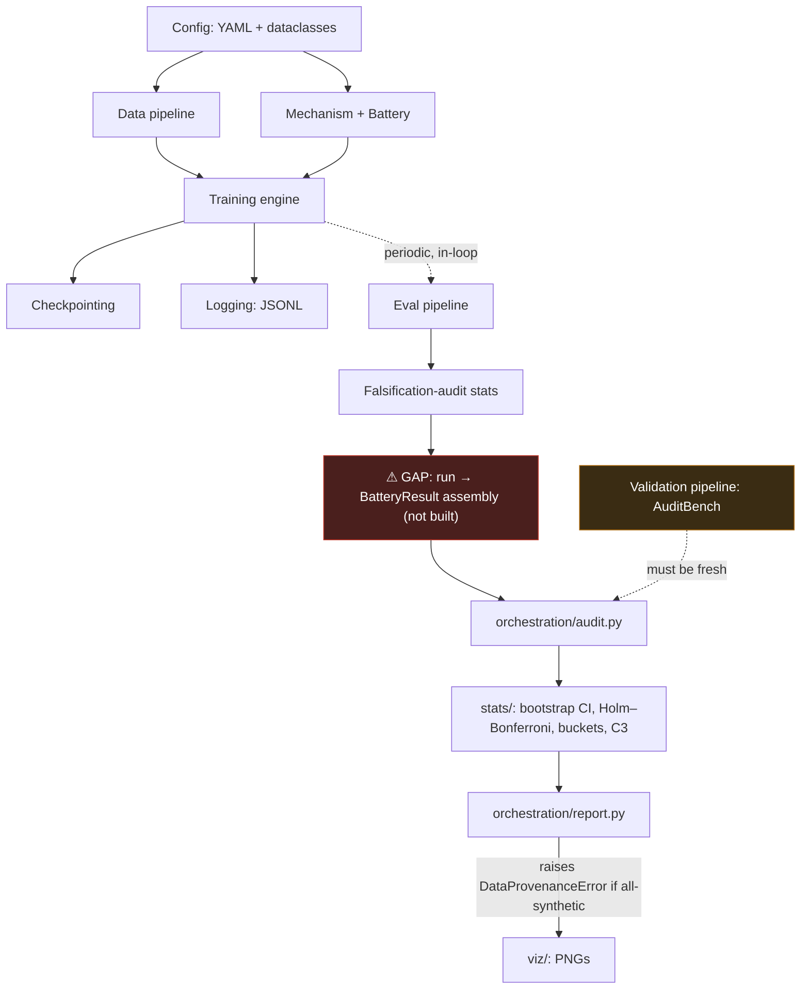

# System Architecture

[← back to README](../README.md)

## Design principle

The training loop (`training/loop.py`) is deliberately unable to tell which mechanism, which battery condition, which device, or which data source it is running. It only ever calls three methods on whatever `Mechanism` object it was handed (`signal`, `should_intervene`, `apply`) and reads `device`/`data_source` off the config. This is not an implementation detail — it's the property that makes the "fair comparison across mechanisms and conditions" claim structural rather than a promise a reviewer has to take on trust.

## The one non-obvious dependency

**Real → Step-matched is not parallelizable within one (mechanism, seed).** Step-matched's fixed intervention schedule is copied from Real's own completed trigger log (`battery/trigger_log.py`). Real must finish training and produce its full JSONL log before Step-matched's condition can even be launched. Across different mechanisms or different seeds, everything still parallelizes fine — the constraint is local to one (mechanism, seed) pair.

## Two things that are structural, not conventions

1. **`device` and `data_source` have no implicit default anywhere.** Every YAML config must spell them out; loading raises `ConfigError` if either is missing. This exists because an earlier session drifted toward a NumPy-only training path in a disk-constrained sandbox — a silent fallback would have let that happen again unnoticed. See `docs/ADVANCED.md`.
2. **`orchestration/report.py` raises `DataProvenanceError`, never silently produces an empty report,** if every available result is tagged `data_source=synthetic`. Filtering out synthetic entries when real ones also exist is fine and expected (wiring tests coexist with real runs during development); an *all-synthetic* result set reaching the report stage is not.

## Module boundaries (why each is separate)

| Module | Owns | Deliberately does NOT own |
|---|---|---|
| `config/` | every tunable, as YAML + dataclasses | any hyperparameter set programmatically in code |
| `data/` | real & synthetic loading behind one `DataSource` interface | knowledge of which one `training/loop.py` is using |
| `mechanisms/` | the `Mechanism` protocol + one class per mechanism | anything about battery conditions |
| `battery/` | the three condition wrappers | the underlying mechanism's own logic — wrappers only intercept `signal`/`should_intervene` |
| `training/` | the single training loop, model, optimizer | which mechanism or condition it's running |
| `checkpointing/` | save/load/retain — atomic writes | mechanism-specific state shape (lives in a generic `mechanism_state: dict`) |
| `eval/` | one `evaluate()`, two call sites | letting the periodic and post-hoc numbers diverge |
| `falsification_audit/` | the MI estimator + AuditBench (pre-existing, untouched) | any import from `training/`, `data/`, or `mechanisms/` |
| `stats/` | bootstrap CI, Holm–Bonferroni, 4-bucket classifier, C3 | any way to attach a p-value to C3 (structurally impossible, not just discouraged) |
| `viz/` | static PNGs only | any GPU or server dependency |
| `orchestration/` | the only layer that imports everything else | any logic duplicated from a module it wires together |

Full per-file detail is in [`docs/MODULES.md`](MODULES.md).
