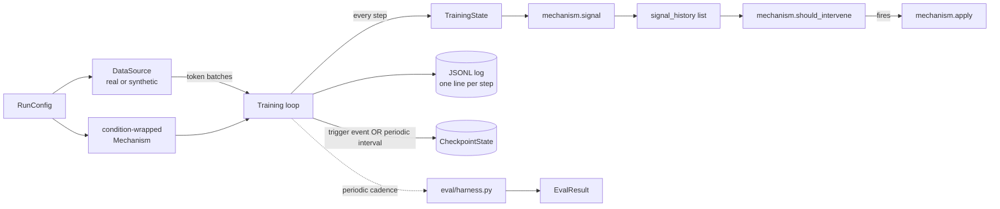
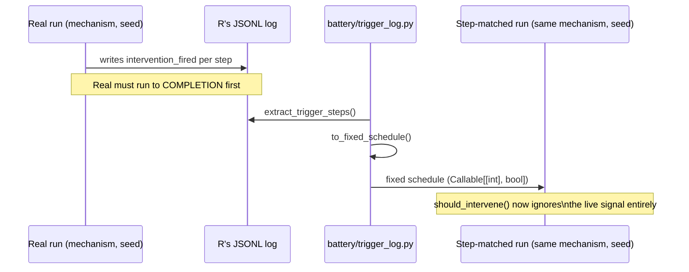
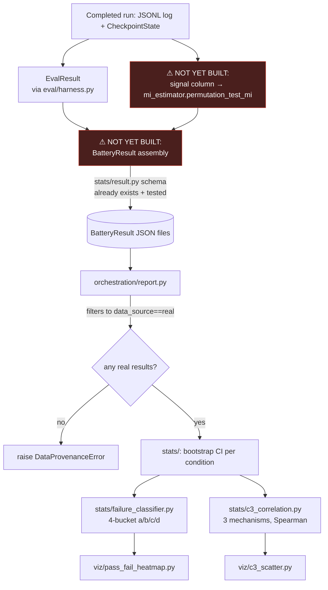
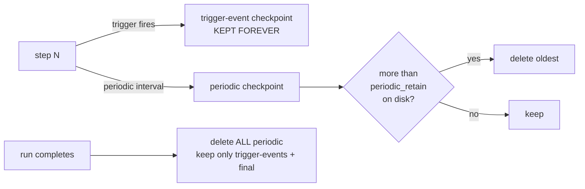

# Data Flow Diagrams

[← back to README](../README.md)

All diagrams are [Mermaid](https://mermaid.js.org/) — they render natively in GitHub's file viewer, no extra tooling needed.

## End-to-end data flow, one training run

## The Real → Step-matched sequencing dependency

This is the only cross-run dependency in the whole pipeline. Scrambled has no such dependency and can run whenever.

## From a finished run to the report — including the gap

The schema (`BatteryResult`), the consumer (`report.py`), and the ingredient (`mi_estimator.permutation_test_mi`, pre-existing and verified) all exist and are tested. The glue connecting them does not exist yet — see [`docs/ADVANCED.md`](ADVANCED.md).

## Checkpoint retention over one run's lifetime

